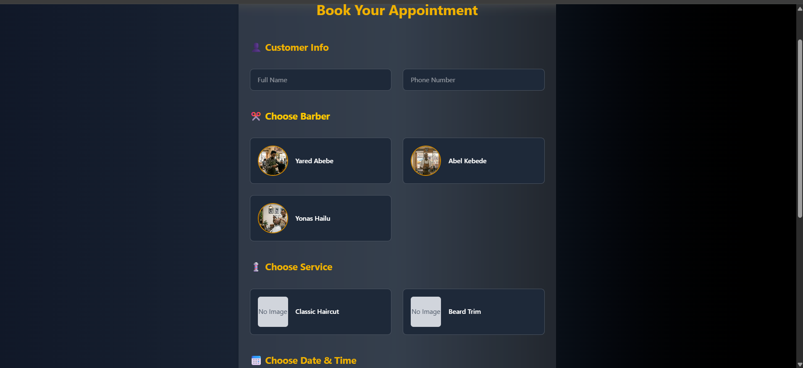
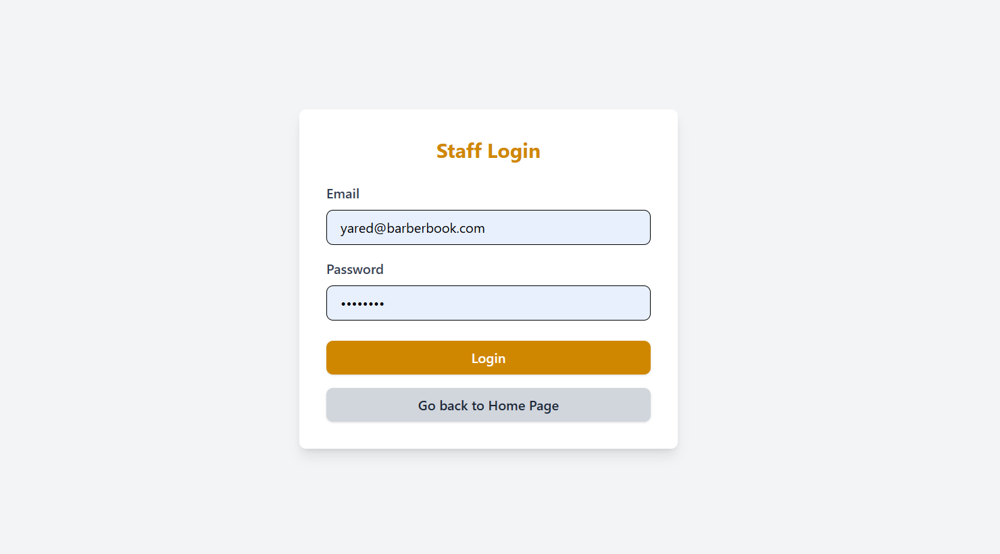
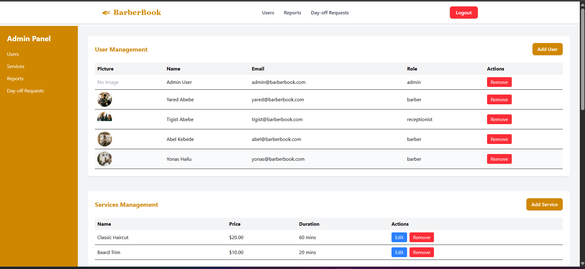
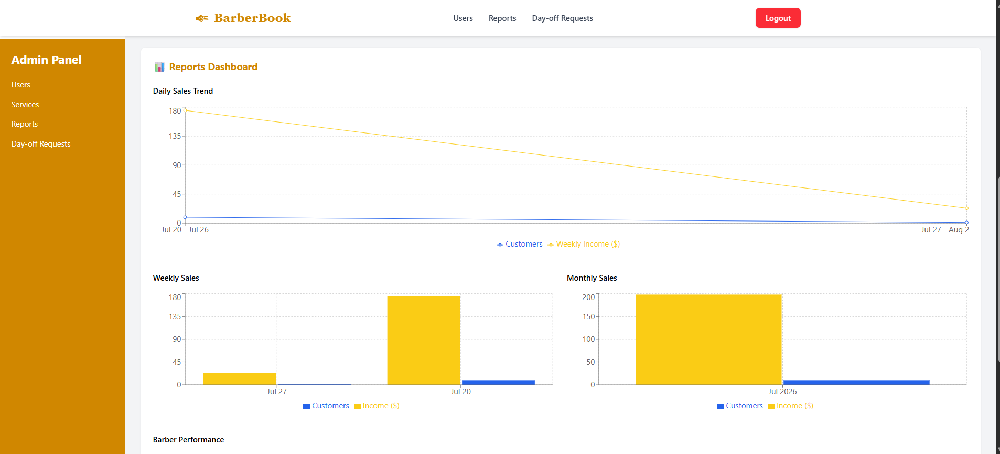
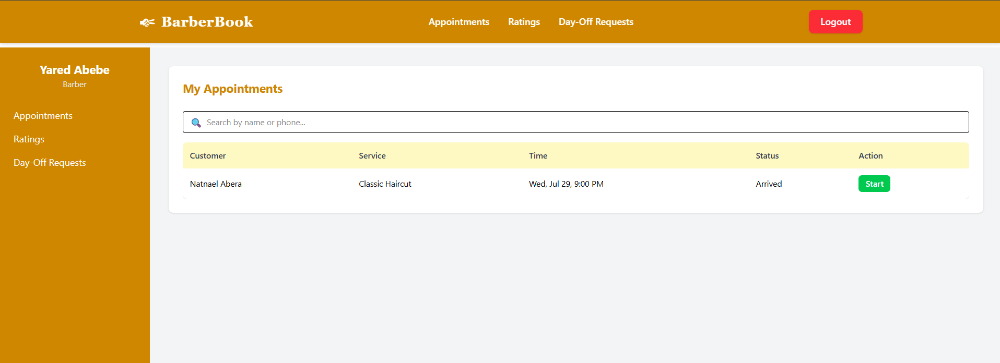
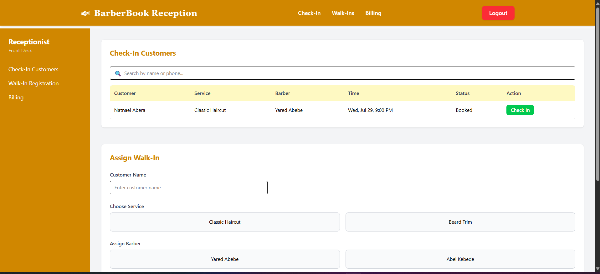

# Mirror — Salon and Shop Management System

A multi-tenant SaaS platform built around the way local barbershops actually work:
reception assigns a walk-in to the barber they choose, the barber completes the service,
and reception collects the bill. Every paid bill is attributed to that barber.

**Local app:** http://127.0.0.1:5173

**Local API:** http://127.0.0.1:5000

## Key Features

- **Fast walk-in flow:** Reception chooses the customer's barber and service without collecting unnecessary customer details.
- **Assign → collect payment:** Reception assigns a customer to their barber, then confirms services and collects payment when the customer returns. No start/finish actions. A customer who leaves before service can be cancelled. Checkout saves the completed visit and payment together, credits the barber, and shows an animated green confirmation. Each checkout defaults to no VAT, with an optional 15% VAT checkbox.
- **Income attribution:** A barber earns recorded revenue only when reception collects that service's payment.
- **Flexible barber pay:** Admin can set salary-only, commission-only, or hybrid pay with a weekly, biweekly, monthly, or custom earnings period. Commission rules are saved on each payment, and barbers see a read-only estimate.
- **Reception operations:** Reception manages payments, inventory, stock adjustments, and shop expenses.
- **Admin control:** Admin manages staff, services, day-off requests, revenue, net income, and barber performance.
- **Self-service signup:** Owners create a separate shop and try management for seven days, then choose an available paid package. Staff and records stay inside their shop.
- **Platform control:** The platform owner monitors subscribers, manages the package catalog and receiving accounts, verifies subscription payments, and receives configured Telegram alerts.
- **Role-based access control** for Platform Admin, Admin, Barber, and Receptionist, enforced via
  JWT authentication and role middleware.

## Packages

| Capability | Mirror Basic | Mirror Plus |
|---|---|---|
| Walk-ins, services, payments, inventory, expenses | Included | Included |
| Owner reports and barber pay settings | Included | Included |
| Website design consultation | — | Complimentary after paid subscription |
| Online booking consultation | — | Discussed directly with the platform team |
| Low-stock alerts and supplier visibility | Included | Included |
| Shop workspaces / accounts including owner | 1 / up to 8 | 1 / up to 50 |

These are the initial offers. The platform package catalog controls current names,
prices, availability, contents and account limits.

## Signup, trial and subscription workflow

- `/` is the platform website, with the workflow, benefits, and current package prices.
- `/signup` creates an owner, their contact phone and an isolated shop with exactly seven days of shop-management access. No card or payment is required.
- `/admin/setup` guides the owner through adding a barber, receptionist and service menu. It creates the shop's cash till. Email validation happens on the team step; server errors return the owner to the exact field without discarding their entries.
- `/login` is the single sign-in for all roles. Team members use the credentials their owner creates.
- The trial countdown appears in the workspace. At expiry, operational API access stops and the owner sees package selection. Existing records remain. Staff see a message asking them to contact the owner.
- In **Admin > Package**, the owner chooses Basic or Plus, transfers the displayed monthly amount to a configured bank or Telebirr account, and submits the transaction reference.
- In **Platform > Payments**, the platform administrator checks the actual receiving account before approving or rejecting the request. Submission alone does not activate access. Approved payments activate one month; an early same-package renewal retains remaining paid days. A different package starts a fresh month, without carrying over old paid time.
- After a paid Plus subscription, the platform team uses the subscriber directory’s owner email and contact phone to discuss complimentary website design and online booking directly. There is no website request, brief, template or publishing workflow in either workspace.

Before accepting subscription payments, add your real receiving bank and Telebirr
accounts in **Platform > Payments**. No receiving accounts or payment gateway are
invented or auto-configured. Platform subscription accounts are separate from the
shop's customer-payment accounts. Pending payments require manual verification;
there are no automatic charges. Cancelling stops workspace operations immediately
and preserves records and owner access to billing.

Existing shops keep their setup when migration 005 is applied. New shops complete
guided setup. The trial is enforced by server time even for users already signed
in; no scheduled job is required to expire access.

## Earlier screenshots

These screenshots predate the current workspace and SaaS website redesign.

**Landing Page**


**Booking**


**Staff Login**


**Admin Dashboard**


**Admin Reports**


**Barber Dashboard**


**Reception Dashboard**


## Tech Stack
- **Backend:** Node.js, Express.js
- **Auth:** JWT (authMiddleware), role-based access (roleMiddleware)
- **Database:** PostgreSQL
- **Architecture:** Route → Controller → Model per domain (Admin, Barber, Receptionist)
- **Runtime:** Local Vite frontend, Express backend, and PostgreSQL

## API Overview
| Role | Sample Endpoints |
|---|---|
| Platform | `GET /platform/overview`, `POST /platform/shops`, `GET /platform/billing`, `POST /platform/billing/accounts`, `PUT /platform/billing/requests/:id` |
| Admin | `POST /admin/users`, `POST /admin/onboarding`, `GET/POST /admin/subscription`, `PUT /admin/shop/subscription` (cancel), `GET /admin/compensation`, `PUT /admin/compensation/:barberId`, `GET /admin/reports/income`, `GET /admin/reports/customer-flow` |
| Barber | `GET /barber/appointments`, `GET /barber/earnings`, `GET /barber/ratings` |
| Receptionist | `POST /receptionist/walkin`, `PUT /receptionist/bills/:id/pay`, `GET /receptionist/inventory`, `POST /receptionist/expenses` |
| Public | `GET /public/plans`, `POST /auth/signup`, `POST /auth/login` |
| Public Plus | `GET /public/shop?shop=<slug>`, `POST /appointments/book` |

## Setup

Requires Node.js 24 and a running local PostgreSQL server. From the project root:

```bash
npm --prefix backend install
npm --prefix frontend install
npm --prefix backend run migrate
npm start
```

`npm start` launches both the frontend and backend. Open http://127.0.0.1:5173.
Press Ctrl+C in that terminal to stop both. Use `npm run dev` to also restart
the backend automatically when its files change. Use `npm run build` to build
the frontend.

Both servers listen only on this computer by default. PostgreSQL runs separately
as the Windows service `postgresql-x64-18` on this computer.

## Environment Variables

Local settings are in `backend/.env` and `frontend/.env`; these files are ignored
by Git. On another computer, copy the corresponding `.env.example` files and
fill in that computer's PostgreSQL password and a random JWT secret. The backend
loads its `.env` automatically regardless of the terminal's working directory.

Backend:

```dotenv
PGHOST=localhost
PGPORT=5432
PGDATABASE=barberbook
PGUSER=postgres
PGPASSWORD=your_local_postgres_password
JWT_SECRET=your_random_secret
HOST=127.0.0.1
PORT=5000
```

Frontend:

```dotenv
VITE_API_URL=http://127.0.0.1:5000
```

The backend uses these PostgreSQL settings directly; a hosted `DATABASE_URL`
is no longer used. Uploaded photos are stored in `backend/uploads`.

## Runtime hardening

The API accepts only the configured browser origin, limits every connection to
600 requests per minute by default, and applies tighter limits to sign-in and
trial-signup endpoints. It also accepts JSON requests up to 256 KB and profile
photos up to 2 MB (PNG, JPG, or WEBP), with random stored filenames.

For a future internet deployment, set a unique 32-character-or-longer
`JWT_SECRET`, set the exact `CORS_ORIGIN`, enable `TRUST_PROXY=true` only behind
the TLS reverse proxy, then run `npm --prefix backend run migrate` before
starting the API. The PostgreSQL pool defaults to 20 connections in production,
has bounded query and lock timeouts, and migration 018 creates the indexes used
by the tenant boards, reports, payment history, closings and ratings.

## Owner reports and Telegram

The admin overview shows the last seven shop days: sales and expenses, customer
flow, payment methods, barber contribution, service demand and team activity.
Each admin page has a link such as `/admin?view=finance`; the selected page and
report dates survive refresh and browser back/forward. Saved daily closings expand
to show each account's received payments, expenses, and cash reconciliation.
Financial reports provide Monday-to-Sunday weeks and calendar months, capped at
today for the current period, with a PDF statement and expense ledger. Sales use
the payment date; collections include optional VAT. Cash movement is not profit,
and current salary agreements are references, not automatic payroll deductions.

Reception must finish checkout before closing the day. There is no unpaid-service
carry-forward report. Previous bills and payment records are preserved.

In **Admin > Telegram reports**, save the shop owner’s BotFather bot token and Telegram
username, start that bot in the owner’s chat, then enable daily reports. Verification
resolves the username to Telegram’s private chat ID and checks the saved bot and chat
without sending a financial message. When reception closes,
Mirror queues one short message with four lines: customer flow (served and
cancelled visits), daily income (service sales excluding VAT), daily expenses,
and low stock (up to three supplies with remaining quantities and a count of any
others). A corrected closing edits that day's message.

The backend and internet connection must be available for delivery. The queue is
stored in PostgreSQL and resumes on startup; failures appear in delivery history.
Confirmed rejections can be retried. If delivery is uncertain, check Telegram
before sending again to avoid duplicates. No messages are sent before configuration.
Tokens are encrypted using `TELEGRAM_ENCRYPTION_KEY`, or the configured `JWT_SECRET`
as a fallback. Keep this secret stable and outside Git; if changed, save the bot
token again. Run `npm --prefix backend run migrate` on other local installations.

Run `npm --prefix backend run test:desk` for isolated database/API checks, including
the owner reports, closing rules, mocked Telegram delivery, signup, atomic shop
setup, seven-day expiry, tenant isolation, and verified subscription payments.
Tests use a disposable database and send no real Telegram messages or payments.

## Platform subscribers, packages and alerts

Open `/platform` with a platform admin account. Subscribers lists each shop and
owner, the current package, free-trial or paid access, expiry, cancellation and
any package awaiting payment approval. Search by shop, owner or email and filter
by package or status. Owners alone choose and cancel subscriptions; the old
platform subscription-override endpoint now rejects changes.

**Platform > Packages** manages names, monthly ETB prices, descriptions, extra
contents, team-account limits, and Basic or Plus capabilities. Public pricing and
owner checkout read the same catalog. Core operations, reports and low-stock
visibility remain included in all packages. Websites and online booking require
an active paid package with Plus capabilities and the corresponding features;
they are never available during a free trial. Select which available package is
used for new seven-day trials. Existing trials keep their assigned package.

Removing a package archives it from sale; it preserves subscribers and payment
history. Restore it to offer it again. Choose another trial default before
removing that package. Price edits affect future purchases, while pending
payments retain their submitted amount and can still be approved after removal.
Capability and account-limit edits apply to shops assigned to the package, but
do not delete existing team accounts or change any shop's chosen plan/status.

**Platform > Telegram & activity** has the one-time platform bot/chat connection.
Enter the BotFather token, the platform admin Telegram username, and frontend origin,
then enable alerts. Start the bot in that Telegram account and use Verify; the app
resolves the username to the private chat ID. Shop owners keep a separate Telegram
bot connection in their own Admin workspace. Verification checks the saved bot and
chat without sending a message.
Activity records new trials, submitted payments, approval/rejection, owner
cancellations and trial/paid expiry. Payment links open
`/platform?view=billing&request=<id>` and survive sign-in. All links require the
appropriate authenticated role; no credentials are embedded in notifications.

Only events recorded while alerts are enabled are queued. Previous events stay
in the activity log. Delivery resumes after a restart, confirmed connection
failures retry, and ambiguous deliveries are held to avoid duplicate messages.
The platform worker checks expiry each minute while the API is running.
Localhost notification links work on this computer only; remote devices need a
reachable frontend address. No hosting changes are needed for local use.

Run migration `007_platform_workspace.sql` through `npm --prefix backend run
migrate`. The isolated test suite covers catalog changes, subscription read-only
controls, dynamic checkout, notification links and mocked platform Telegram
delivery, alongside the existing shop workflows.

## Access the local database

In pgAdmin or another PostgreSQL client, connect to host `localhost`, port
`5432`, username `postgres`, and database `barberbook`. Use the password saved
in `backend/.env`. With the PostgreSQL command-line tools installed:

```bash
psql -h localhost -p 5432 -U postgres -d barberbook
```

## Migration status

The existing local database is connected and its data has been preserved.
A fresh PostgreSQL custom-format backup and a copy of the uploaded photos are
in the ignored `backups/` directory. The old SQL files in `backend/` are historical
backups, not a verified export of the current Neon database.

Copying the latest Neon data and taking the Vercel and Render deployments offline
are still pending hosting-account access. Until that work is verified, the local
database should not be treated as an up-to-date copy of Neon.
